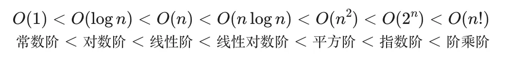
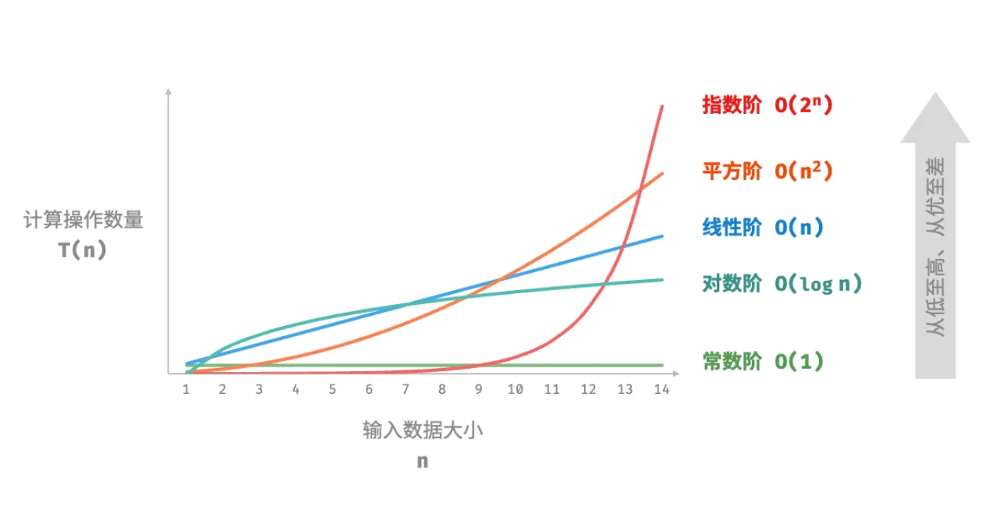

# awesome-algorithm-note
常用算法：穷举法、回溯法、分治递归、贪心法、动态规划

穷举：也就是枚举法，都一一列出来

回溯：按照某一顺序进行检验，当当前候选不满足条件时，回退到上一步重新选择下一候选

分治：自顶向下的设计，将一个大问题分割若干子问题，各个击破，分而治之，然后子问题解集合起来得出原解

贪心：寄希望于局部最优解得出全局最优解

动态规划：分解的子问题不是互相独立的，保存一个表记录所有已解决的子问题的答案

## 复杂度分析

