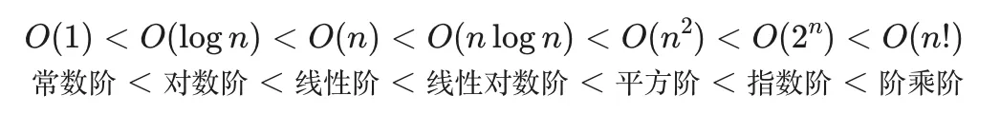
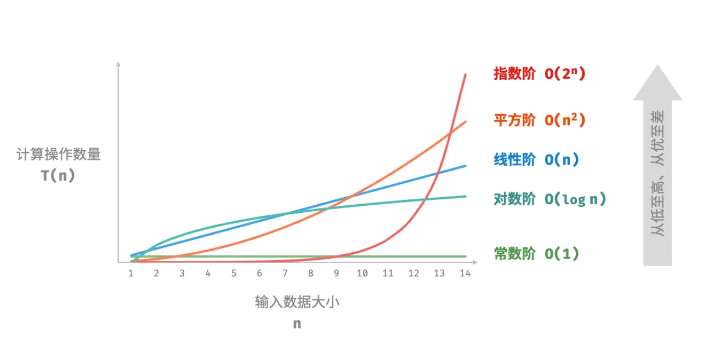
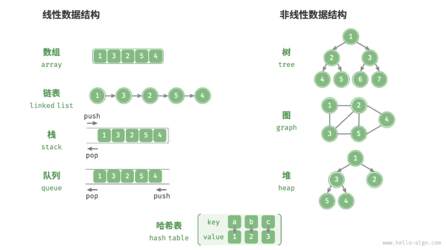

# awesome-algorithm-note
常用算法：穷举法、回溯法、分治递归、贪心法、动态规划

穷举：也就是枚举法，都一一列出来

回溯：按照某一顺序进行检验，当当前候选不满足条件时，回退到上一步重新选择下一候选

分治：自顶向下的设计，将一个大问题分割若干子问题，各个击破，分而治之，然后子问题解集合起来得出原解

贪心：寄希望于局部最优解得出全局最优解

动态规划：分解的子问题不是互相独立的，保存一个表记录所有已解决的子问题的答案

## 复杂度分析





O(1): 操作数量与输入数据大小 n 无关

O(n): 单层循环

O(n<sup>2</sup>): 嵌套循环

O(2<sup>n</sup>): 二叉树、递归、细胞分裂；指数阶增长非常迅速，在穷举法（暴力搜索、回溯等）中常见。对于数据较大的问题是不可接受的，通常需要使用动态规划或贪心算法等来解决。

O(log n): 分治、递归、每轮缩减一半

O(nlog n): 两层循环，一层n，一层log n

O(n!): 递归，全排列 n! = n * (n-1) * ... * 2 * 1

## 数据结构

- **线性数据结构**：数组、链表、栈、队列、哈希表，元素之间是一对一的顺序关系。
- **非线性数据结构**：树、堆、图、哈希表。



### 基本数据类型

- 整数类型 `byte`、`short`、`int`、`long` 。
- 浮点数类型 `float`、`double` ，用于表示小数。
- 字符类型 `char` ，用于表示各种语言的字母、标点符号甚至表情符号等。
- 布尔类型 `bool` ，用于表示“是”与“否”判断。

### 绪论

- 原码、反码和补码是在计算机中编码数字的三种方法，它们之间可以相互转换。整数的原码的最高位是符号位，其余位是数字的值。
- 整数在计算机中是以补码的形式存储的。在补码表示下，计算机可以对正数和负数的加法一视同仁，不需要为减法操作单独设计特殊的硬件电路，并且不存在正负零歧义的问题。
- 浮点数的编码由 1 位符号位、8 位指数位和 23 位分数位构成。由于存在指数位，因此浮点数的取值范围远大于整数，代价是牺牲了精度。
- ASCII 码是最早出现的英文字符集，长度为 1 字节，共收录 127 个字符。GBK 字符集是常用的中文字符集，共收录两万多个汉字。Unicode 致力于提供一个完整的字符集标准，收录世界上各种语言的字符，从而解决由于字符编码方法不一致而导致的乱码问题。
- UTF-8 是最受欢迎的 Unicode 编码方法，通用性非常好。它是一种变长的编码方法，具有很好的扩展性，有效提升了存储空间的使用效率。UTF-16 和 UTF-32 是等长的编码方法。在编码中文时，UTF-16 占用的空间比 UTF-8 更小。Java 和 C# 等编程语言默认使用 UTF-16 编码。

## 数组与链表

### 数组

普通算法中的数组（array）是一种线性数据结构，其将相同类型的元素存储在连续的内存空间中，长度固定。

```typescript
/* 初始化数组 */
let arr: number[] = new Array(5).fill(0);
let nums: number[] = [1, 3, 2, 5, 4];
/* 访问数组 */
nums[index] //复杂度O(1)
```

| 操作     | 方法                                           | 示例                              |
| :------- | :--------------------------------------------- | :-------------------------------- |
| **插入** | `push()`                                       | `arr.push(4)` 数组尾部插入        |
|          | `unshift()`                                    | `arr.unshift(0)` 数组头部插入     |
|          | `splice(index, deleteNum, addItem1, addItem2)` | `arr.splice(1, 0, 1.5)`           |
| **删除** | `pop()`                                        | `arr.pop()` 尾部                  |
|          | `shift()`                                      | `arr.shift()` 头部                |
|          | `splice()`                                     | `arr.splice(1, 2)`                |
|          | `filter()`                                     | `arr.filter(item => item == 3)`   |
|          | `slice(beginIndex, endIndex)`                  | 包前不包后                        |
| **查找** | `indexOf()`                                    | `arr.indexOf(3)`                  |
|          | `includes()`                                   | `arr.includes(3)`                 |
|          | `find()`                                       | `arr.find(item => item > 2)`      |
|          | `findIndex()`                                  | `arr.findIndex(item => item > 2)` |

### 链表

链表（linked list）是一种线性数据结构，其中的每个元素都是一个节点对象，各个节点通过“引用”相连接。引用记录了下一个节点的内存地址，通过它可以从当前节点访问到下一个节点。可在内存区域分散储存。

- **单向链表**：即前面介绍的普通链表。单向链表的节点包含值和指向下一节点的引用两项数据。我们将首个节点称为头节点，将最后一个节点称为尾节点，尾节点指向空 `None` 。
- **环形链表**：如果我们令单向链表的尾节点指向头节点（首尾相接），则得到一个环形链表。在环形链表中，任意节点都可以视作头节点。
- **双向链表**：与单向链表相比，双向链表记录了两个方向的引用。双向链表的节点定义同时包含指向后继节点（下一个节点）和前驱节点（上一个节点）的引用（指针）。相较于单向链表，双向链表更具灵活性，可以朝两个方向遍历链表，但相应地也需要占用更多的内存空间。

|          | 数组                           | 链表           |
| :------- | :----------------------------- | :------------- |
| 存储方式 | 连续内存空间                   | 分散内存空间   |
| 容量扩展 | 长度不可变                     | 可灵活扩展     |
| 内存效率 | 元素占用内存少、但可能浪费空间 | 元素占用内存多 |
| 访问元素 | O(1)                           | O(n)           |
| 添加元素 | O(n)                           | O(1)           |
| 删除元素 | O(n)                           | O(1)           |

### 列表(动态数组)

动态数组继承了数组的各项优点，并且可以在程序运行过程中进行动态扩容。许多编程语言中的标准库提供的列表是基于动态数组实现的，例如 Python 中的 `list` 、Java 中的 `ArrayList` 、C++ 中的 `vector` 和 C# 中的 `List`还有JavaScript的数组等。
